# Salary-prediction-
<h1>La régression linéaire simple : </h1>
<b>La régression linéaire simple</b> est une méthode d'analyse statistique qui permet de modéliser la relation entre deux variables : une variable indépendante (ou variable explicative) et une variable dépendante (ou variable à expliquer). Elle est souvent utilisée en sciences sociales, en économie, en finance et dans d'autres domaines pour analyser les données et prévoir des tendances.
 
La régression linéaire simple suppose que la relation entre les deux variables est linéaire, c'est-à-dire que la variation de la variable dépendante est proportionnelle à la variation de la variable indépendante. Elle est représentée par l'équation de la droite : <b> y = a + bx </b> 
 
où y est la variable dépendante, x est la variable indépendante, a est l'ordonnée à l'origine (l'intersection de la droite avec l'axe des y) et b est le coefficient de pente (la variation de y pour une variation d'une unité de x).
 
La régression linéaire simple consiste à trouver la droite qui "s'ajuste" le mieux aux données. Cela se fait en minimisant la somme des carrés des écarts entre les valeurs observées et les valeurs prédites par la droite de régression. Cette méthode est appelée la méthode des moindres carrés.
 
Pour estimer les coefficients a et b de l'équation de la droite, nous utilisons les données observées de la variable indépendante x et de la variable dépendante y. Plus précisément, nous calculons :
<ul>
  <li>la moyenne de x (x_bar) et de y (y_bar)</li>
  <li>la variance de x (squared_dev_x) et de y (squared_dev_y)</li>
  <li>la covariance de x et y (cov_xy)</li>
</ul>
Ensuite, nous calculons le coefficient de pente b en utilisant la formule suivante : 
b = cov_xy / squared_dev_x
 
et l'ordonnée à l'origine a en utilisant la formule suivante :
 
a = y_bar - b * x_bar
Une fois que nous avons estimé les coefficients a et b, nous pouvons utiliser l'équation de la droite pour prédire les valeurs de la variable dépendante y pour une valeur donnée de la variable indépendante x.
<b> Remarque</b> c'était seulement une petite introduction sur la régression linéaire simple. 
<h4>Alors là je vais expliquer un petit peu le code : </h4>
La première étape c'est l'importation des bibliothèques nécessaires
Au début j'ai importer les trois bibliothèques numpy , matplotlib.pyplot et pandas
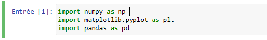
En suite on doit lire le dataset à l'aide de la bibliotèque pandas
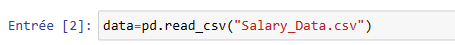
Cette ligne de code importe un jeu de données à partir d'un fichier CSV et le stocke dans un objet de dataframe de pandas nommé "data".
<h5>Afficher les informations stocké dans la variable `data'</h5>
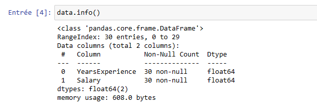
La méthode info() de pandas affiche un résumé concis d'un dataframe, qui inclut notamment :
<ul>
  <li>Le nombre total de lignes et de colonnes dans le dataframe.</li>
  <li>Le nom de chaque colonne et le nombre de valeurs non nulles qu'elle contient.</li>
  <li>Le type de données de chaque colonne (par exemple, int, float, object).</li>
  <li>La quantité de mémoire utilisée par le dataframe.</li>
</ul>
En appelant data.info(), on va afficher ces informations pour le dataframe stocké dans la variable `data'
<h5>Diviser les données</h5>
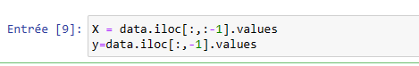
Ces deux lignes de code divisent les données en une variable indépendante (X) et une variable dépendante (y).
<h5>Visualiser les données</h5>
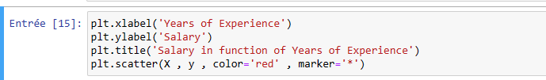
Ces lignes de code créent un graphique à dispersion (scatter plot) des données en utilisant la bibliothèque Matplotlib.
<ul>
   <li><b>plt.xlabel('Years of Experience') :</b> Cette ligne de code ajoute une étiquette pour l'axe des abscisses, qui représente les années d'expérience.</li>
   <li><b>plt.ylabel('Salary') :</b> Cette ligne de code ajoute une étiquette pour l'axe des ordonnées, qui représente le salaire.</li>
   <li><b>plt.title('Salary in function of Years of Experience') :</b> Cette ligne de code ajoute un titre au graphique.</li>
   <li><b>plt.scatter(X , y , color='red' , marker='*') :</b> Cette ligne de code crée un graphique à dispersion des données. Les valeurs de X sont tracées sur l'axe des abscisses et les valeurs de y sont tracées sur l'axe des ordonnées. Les points de données sont affichés en rouge avec des marqueurs en forme d'étoile (*).</li>
</ul>
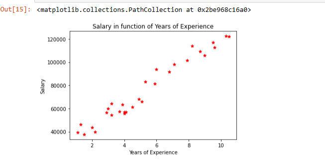
<h5>diviser les données en ensembles de training et de test</h5>
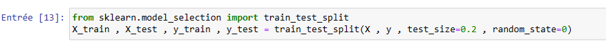
Cette ligne de code utilise la fonction train_test_split() de la bibliothèque scikit-learn (sklearn) pour diviser les données en ensembles de training et de test.
<h5>Entraîner le modèle</h5>
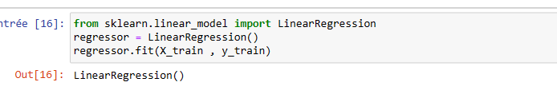
Ces lignes de code utilisent la bibliothèque scikit-learn (sklearn) pour entraîner un modèle de régression linéaire simple sur les données d'entraînement.
<h5>Prédire le résultat</h5>
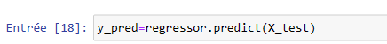
Cette ligne de code utilise le modèle de régression linéaire entraîné pour faire des prédictions sur les données de test.
<h5>Afficher les valeurs de y_pred et y_test</h5>
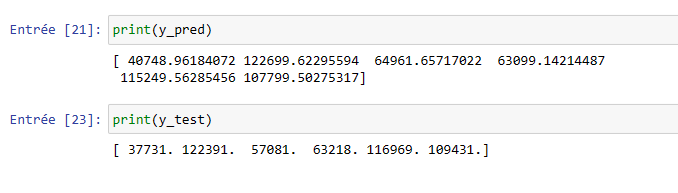
<h5>Visualiser les résultats du training</h5>
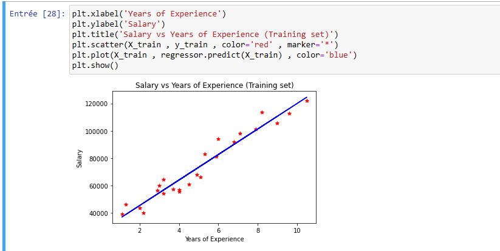
<h5>Visualiser les résultats du test</h5>
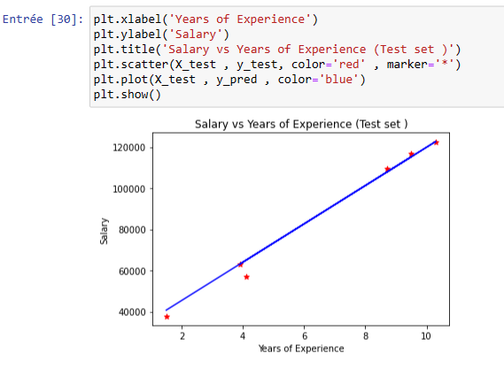
